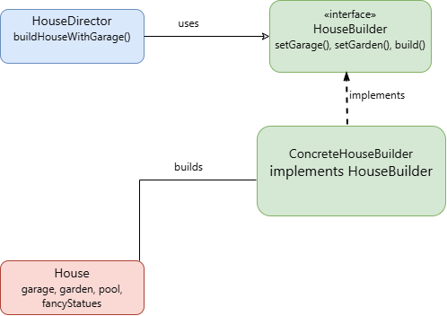
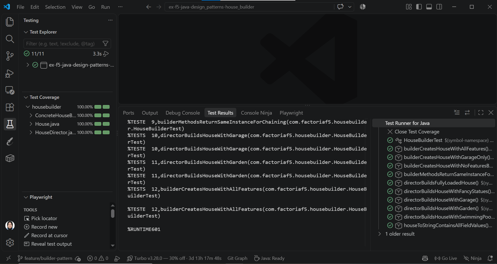

# House Builder — Design Patterns Exercise

Java exercise applying the **Builder** design pattern to construct different
configurations of a `House` entity (garage, garden, swimming pool, fancy statues).

## Design pattern

**Type:** Creational design pattern

**Goal:** Build complex objects step by step, allowing the same construction
process to produce different representations of a product.

## Structure

- `House` — the **Product**. An immutable object with four optional features:
  garage, garden, swimming pool, and fancy statues.
- `HouseBuilder` — the **Builder interface**. Declares one setter per feature
  (each returning `HouseBuilder` for method chaining) plus a `build()` method.
- `ConcreteHouseBuilder` — implements `HouseBuilder`, accumulates configuration,
  and produces a `House` via `build()`.
- `HouseDirector` — the **Director**. Encapsulates predefined "recipes" for
  common house configurations (e.g. `buildHouseWithGarage()`,
  `buildFullyLoadedHouse()`) without exposing construction details to the client.

## Class diagram



## How to build a House

```java
// Using the builder directly
House house = new ConcreteHouseBuilder()
        .setGarage(true)
        .setGarden(true)
        .build();

// Using the Director for a predefined configuration
HouseDirector director = new HouseDirector(new ConcreteHouseBuilder());
House fullyLoaded = director.buildFullyLoadedHouse();
```

## Requirements

- Java 21
- Maven

## Running tests

```
mvn test
```

Coverage report is generated at `target/site/jacoco/index.html`.

## Test coverage



Current coverage: **100%** across all classes (minimum required: 70%).